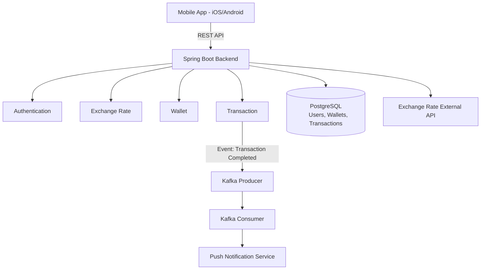
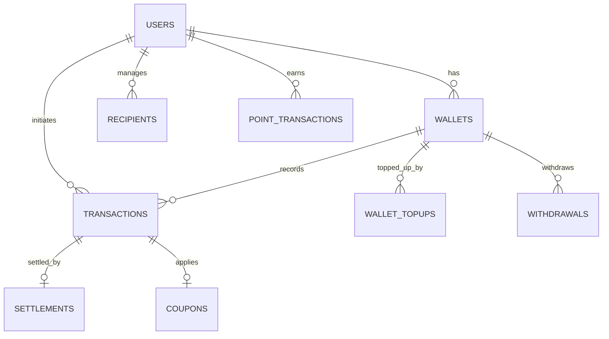

# SwapOn — JPY ⇄ IDR Currency Exchange Backend

SwapOn adalah platform fintech untuk transfer uang antara Jepang (JPY) dan Indonesia (IDR). Sistem mencakup kalkulasi kurs real-time, sistem fee bertingkat, e-wallet internal, reward point, coupon, serta metode pembayaran fleksibel (bank transfer & credit card), dikembangkan sebagai freelance project untuk klien berbasis di Jepang.

## Fitur Utama
- **Real-time Exchange Rate** — integrasi kurs JPY⇄IDR dengan rate lock selama proses transaksi berlangsung
- **Tiered Fee System** — base fee 110 JPY + tier fee berdasarkan nominal transaksi, plus fee tambahan 1–3% untuk pembayaran kartu kredit
- **E-Wallet** — sistem saldo (balance) dan reward point terpisah, top up, serta wallet ledger untuk audit trail
- **Reward Point & Coupon** — klaim poin harian (1x/hari, expired 30 hari) dan sistem kupon dengan validasi masa berlaku & limit penggunaan
- **Multi Payment Method** — wallet, bank transfer Jepang (Paypal), dan kartu kredit (Mastercard, Visa, JCB) via Stripe
- **Anti-Money Laundering (AML)** — validasi & kontrol keamanan transaksi finansial
- **Admin Verification** — dashboard admin untuk verifikasi transaksi, approval top up, dan audit log
- **Event-driven Notification** — Kafka producer/consumer untuk memproses event transaksi selesai secara asinkron, dilanjutkan push notification

## Tech Stack
Java 21 · Spring Boot · PostgreSQL · Docker · REST API

| Layer | Teknologi |
|---|---|
| Backend Framework | Spring Boot (Java 21) |
| Database | PostgreSQL |
| Message Broker | Apache Kafka (event-driven transaction processing) |
| Cache | Redis |
| Payment Gateway | Stripe (card payout), GMO Payment & Wise (pending approval) |
| Auth | JWT, Google OAuth (Firebase) |
| Containerization | Docker, Docker Compose |
| API Testing | Postman (202 endpoints) |
| Cloud (planned) | AWS |

## Full System Flow
1. User registrasi/login
2. User top up wallet (opsional)
3. User input jumlah transfer
4. Sistem mengambil kurs real-time & mengunci rate selama transaksi
5. Sistem menghitung konversi & fee (base + tier)
6. User menerapkan coupon (opsional)
7. User menerapkan reward point (opsional)
8. User memilih metode pembayaran (wallet/bank/kartu kredit)
9. User menyelesaikan pembayaran
10. Admin memverifikasi transaksi
11. Admin transfer dana ke penerima
12. Transaksi ditandai selesai → event dikirim via Kafka → notifikasi terkirim

## Architecture Overview


## Entity Overview


## Project Structure
```
yen-exchange/
├── docker-compose.yml        # Orkestrasi service (app, DB, Kafka, Redis)
├── Dockerfile
├── postman/                    # Koleksi 202 endpoint API
├── build.gradle
└── src/main/java/.../yenexchange/
    ├── config/
    │   ├── SecurityConfig.java          # JWT & role-based access
    │   ├── JwtAuthenticationFilter.java
    │   ├── FirebaseConfig.java          # Google OAuth
    │   ├── KafkaConfig.java             # Konfigurasi producer/consumer
    │   ├── StripeConfig.java
    │   └── DataSeeder.java
    ├── controller/            # 18 REST controllers (Auth, Wallet, Transaction,
    │                          # Recipient, Payment, Point, Coupon, Admin, dll.)
    ├── service/                # 27 service classes — business logic utama:
    │   ├── UserService, WalletService, TransactionService
    │   ├── RateService, FeeService, RiskService (AML)
    │   ├── PaymentService, PaymentMethod, CreditCardService
    │   ├── CouponService, PointService, WalletTopupService
    │   ├── SettlementService, WithdrawalService, RecipientService
    │   ├── AdminTransactionService, AuditService, DashboardService
    │   ├── KafkaProducerService, NotificationService, PushNotificationService
    │   ├── JwtService, GoogleAuthService, EmailService
    │   ├── LedgerService, RedisService, ExternalRateService
    │   └── payout/                        # Integrasi GMO Payment & Wise
    ├── consumer/
    │   └── TransactionCompletedConsumer.java   # Kafka consumer
    ├── scheduler/
    │   └── TransactionScheduler.java      # Job terjadwal (cek status transaksi)
    ├── repository/            # 13 JPA repositories
    ├── entity/                 # 19 entity (User, Wallet, Transaction, Coupon, dll.)
    ├── dto/                     # Request/response DTOs
    └── exception/              # Global exception handling
```

## API
Total **202 endpoint** terdokumentasi di Postman collection, mencakup modul Auth, Wallet, Transaction, Recipient, Payment, Coupon, Point, Notification, Admin Dashboard, hingga Audit Log.

## Tech Highlights
- **Event-driven architecture** dengan Kafka — proses notifikasi transaksi didesain asinkron agar tidak membebani response time API utama
- **Fee engine** — kalkulasi fee bertingkat (base + tier) dan fee kartu kredit dihitung sepenuhnya di backend untuk mencegah manipulasi dari sisi client
- **Rate locking** — kurs dikunci saat transaksi dimulai untuk mencegah selisih akibat fluktuasi rate real-time
- **AML & Risk Control** — `RiskService` menangani validasi keamanan transaksi
- **Idempotency** — `ProcessedWebhookRepository` & `DuplicateTransactionException` mencegah pemrosesan transaksi ganda dari webhook payment gateway

## Project Status
```
🟢 **Near Production Ready** — Backend dan mobile app sudah hampir selesai dan disiapkan untuk deployment AWS serta peluncuran di Google Play Store & App Store.
🟡 **Pending** — GMO Payment & Wise Payout masih menunggu approval/verifikasi provider. 
```

## Peran Saya
Backend Developer — mengembangkan REST API dengan Spring Boot, merancang skema database PostgreSQL, mengimplementasikan business logic wallet & transaksi, integrasi payment gateway (Stripe) dan exchange rate eksternal, serta menyiapkan backend untuk deployment AWS.

*Source code bersifat privat & rahasia karena mengandung kode milik klien yang belum diluncurkan secara publik. Detail teknis dapat didiskusikan lebih lanjut — silakan hubungi saya di bellamelatiwd@gmail.com.*
